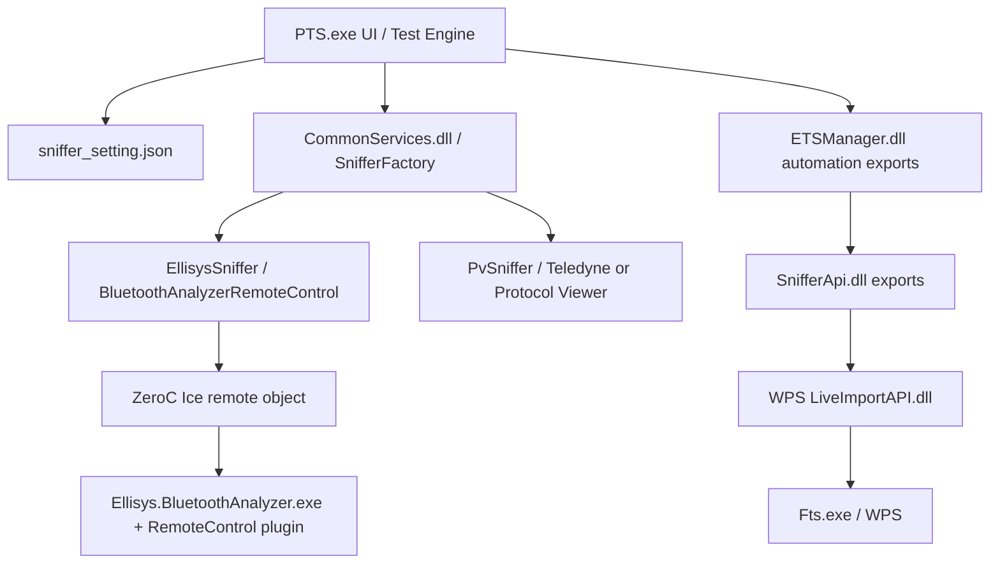
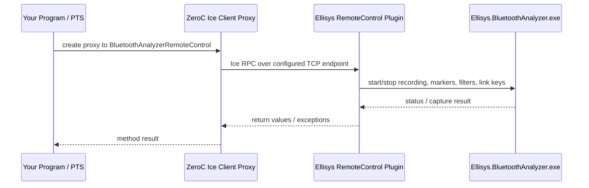

# PTS Sniffer Remote Control 分析与实现清单

本文基于本机 `E:\Bluetooth PTS`、已安装的 Teledyne LeCroy Wireless Protocol Suite 4.60、Ellisys Bluetooth Analyzer Remote Control 插件，以及 Bluetooth SIG 官方说明整理。目标是说明 PTS 如何控制抓包软件，并给出自己的程序加入 Remote Control 功能时可执行的实现路线。

## 结论

PTS 对抓包软件不是通过同一种协议控制：

- Teledyne WPS/Frontline 路径：核心是 `SnifferApi.dll` 调用 WPS 的 `LiveImportAPI.dll`，同时 WPS 自带 `FTSAutoServer.exe` 暴露一个更适合第三方程序使用的 ASCII TCP Automation Server，默认端口 `22901`。
- Ellisys 路径：核心是 Ellisys Remote Control Plugin，协议栈是 ZeroC Ice/.NET 远程对象，不是简单裸 TCP 文本协议。PTS 通过 `CommonServices.dll` 里的 `EllisysSniffer` 和 `BluetoothAnalyzerRemoteControl` 代理去调用 `StartRecording`、`StopRecordingAndSaveTraceFile`、`AddLinkKey`、`ConfigureDeviceFilter` 等方法。
- PTS 的 HCI/测试日志桥接主要用于给抓包文件加测试用例标记、注释、link key、HCI/LiveImport 数据等；真正的 OTA 抓包数据通常仍由 Ellisys/WPS 硬件和分析软件自己采集。

## 本机配置证据

PTS sniffer 设置位于：

```text
%APPDATA%\Bluetooth_SIG\ProfileTuningSuite_6\sniffer_setting.json
```

当前内容：

```json
{
  "EnableSniffer": true,
  "ActiveSniffer": "Ellisys",
  "EllisysSnifferInstallationPath": "C:\\ProgramData\\Ellisys\\Ellisys Bluetooth Analyzer\\Updates\\current",
  "EllisysSnifferTcpPort": 46148,
  "EllisysSnifferUdpPort": 24352,
  "TeledyneInstallationPath": "C:\\Program Files (x86)\\Teledyne LeCroy Wireless\\Wireless Protocol Suite 2.20"
}
```

注意：本机实际安装了 WPS 4.60：

```text
C:\Program Files (x86)\Teledyne LeCroy Wireless\Wireless Protocol Suite 4.60
```

但 PTS 设置里仍指向 `2.20`。如果切换到 Teledyne，需要先在 PTS 的 `File -> Application Settings -> Sniffer` 里把 Teledyne 路径改到 4.60，或者直接修改上述 JSON。PTS 字符串中有版本检查提示：`The installed version of Teledyne WPS is not supported, must be {0} or newer.`

PTS sniffer 二进制：

```text
E:\Bluetooth PTS\bin\SnifferApi.dll
E:\Bluetooth PTS\bin\CommonServices.dll
E:\Bluetooth PTS\bin\ETSManager.dll
E:\Bluetooth PTS\bin\Ice.dll
E:\Bluetooth PTS\bin\snifferapi.ini
```

`snifferapi.ini` 当前只有按钮行为配置：

```ini
[settings]
;; DontPressGreenButton=0        ;; Default is 0
;; DontPressEraserButton=1       ;; Default is 1
```

## PTS 组件分层



`ETSManager.dll` 暴露的 sniffer 相关导出包括：

```text
InitSniffer
SnifferInitializeEx
SnifferIsConnectedEx
SnifferIsRunningEx
SnifferLogVerdictDescriptionEx
SnifferRegisterNotificationEx
SnifferSaveEx
SnifferSaveAndClearEx
SnifferClearEx
SnifferTerminateEx
```

PTS 示例 `E:\Bluetooth PTS\SampleCode\ETSManagerClient\ETSPythonClient.py` 展示了典型顺序：

```text
InitSniffer()
SnifferInitializeEx()
如果 Protocol Viewer 未运行则启动 FTS.exe
SnifferRegisterNotificationEx()
SnifferClearEx()
StartTestCaseEx(...)
TestCaseFinishedEx(...)
SnifferSaveEx(...) 或 SnifferSaveAndClearEx(...)
SnifferTerminateEx()
```

这说明 PTS 测试引擎把“测试开始/结束、保存/清空、日志/判定描述”通过 ETSManager/SnifferApi 送到 sniffer 层。

## Teledyne WPS 控制链路

本机 WPS 4.60 关键文件：

```text
C:\Program Files (x86)\Teledyne LeCroy Wireless\Wireless Protocol Suite 4.60\Executables\Core\Fts.exe
C:\Program Files (x86)\Teledyne LeCroy Wireless\Wireless Protocol Suite 4.60\Executables\Core\FTSAutoServer.exe
C:\Program Files (x86)\Teledyne LeCroy Wireless\Wireless Protocol Suite 4.60\Executables\Core\LiveImportAPI.dll
C:\Program Files (x86)\Teledyne LeCroy Wireless\Wireless Protocol Suite 4.60\liveimport.ini
C:\Program Files (x86)\Teledyne LeCroy Wireless\Wireless Protocol Suite 4.60\Help and Tools\Automation Server
```

Teledyne 官方下载页当前列出的 Windows 版 WPS 为 `4.60 Build 25.9.37086.37567`。这和本机安装目录 `Wireless Protocol Suite 4.60` 匹配。

`SnifferApi.dll` 导出：

```text
SnifferInitialize
SnifferStartApplication
SnifferStartSniffing
SnifferStopSniffing
SnifferLogHci
SnifferLogVerdictDescription
SnifferTestCaseStarted
SnifferTestCaseEnded
SnifferSave
SnifferSaveAndClear
SnifferClear
SnifferTerminate
```

`SnifferApi.dll` 字符串显示它会找：

```text
Executables\Core\LiveImportAPI.dll
executables\core\fts.exe
LiveImport.ini
software\teledyne lecroy wireless
software\teledyne lecroy wireless\user data
```

`LiveImportAPI.dll` 导出非常明确，包含数据/注释/保存桥接：

```text
InitializeLiveImport
ReleaseLiveImport
SendFrame / SendFrame2 / SendFrame3 / SendFrame4
SendFrameWithComment
SendComment
SendNotification
SendStartOfFrame / SendEndOfFrame
SaveCapture
SaveAndClear
ClearCapture
ConnectToDataServer
```

`liveimport.ini` 说明 Live Import 通过 connection string 把 FTS 和数据源配对：

```ini
[General]
ConnectionString="Wireless Protocol Suite Live Import.FDFFFFFF!A51EEBF13DE32BEA4933A8E519DB795D8EB02D;D06C136E"

[Configuration]
Version=6
Sides="Host,1000000;Controller,1000000"
StackAuto=true
Stack=0x7f008039
Drf="Command;ACL;SCO;Event"
```

### 第三方程序推荐走 WPS Automation Server

WPS 自带的官方 Automation Server 更适合第三方程序直接使用。配置在：

```text
C:\Program Files (x86)\Teledyne LeCroy Wireless\Wireless Protocol Suite 4.60\Executables\Core\FTSAutoServer.exe.config
```

默认端口：

```xml
<add key="Port" value="22901"/>
```

支持的 personality/OEM key：

```text
SODERA
X240
DoubleX240
TripleX240
Virtual
X500
X500e
X700
LE_TESTER
```

官方 Python 样例：

```text
C:\Program Files (x86)\Teledyne LeCroy Wireless\Wireless Protocol Suite 4.60\Help and Tools\Automation Server\sample_wps_client.py
```

基本命令是 ASCII TCP：

```text
Start FTS;<fts.exe directory>;<personality key>
Is Initialized
Config Settings;IOParameters;<datasource key>;<config settings>
Start Record
Start Analyze
Stop Record
Is Analyze Complete
Stop Analyze
Query State
Is Processing Complete
Save Capture;<absolute .cfax path>
Stop FTS
```

命令响应格式：

```text
<COMMAND>;<STATUS>[;<STATE>][;Reason=<reason>]
```

`SUCCEEDED` 只表示命令已送达 analyzer，不一定表示动作已经完整完成。因此保存前必须轮询 `Is Analyze Complete`、`Query State`、`Is Processing Complete`。

### WPS 最小 Python 控制骨架

```python
import socket
import subprocess
import time
from pathlib import Path

WPS = Path(r"C:\Program Files (x86)\Teledyne LeCroy Wireless\Wireless Protocol Suite 4.60")
CORE = WPS / "Executables" / "Core"
SERVER = CORE / "FTSAutoServer.exe"
HOST = "127.0.0.1"
PORT = 22901
PERSONALITY = "X240"  # 或 SODERA / X500 / X500e / Virtual
CAPTURE = Path(r"C:\Users\Public\Documents\Teledyne LeCroy Wireless\My Capture Files\pts_like_capture.cfax")

def send(sock, cmd):
    sock.sendall(cmd.encode("utf-8"))
    data = sock.recv(4096).decode("utf-8", errors="replace")
    print(cmd, "=>", data)
    return data

proc = subprocess.Popen([str(SERVER)])
time.sleep(2)

with socket.create_connection((HOST, PORT), timeout=20) as s:
    print(s.recv(4096).decode("utf-8", errors="replace"))
    send(s, f"Start FTS;{CORE};{PERSONALITY}")

    while "SUCCEEDED" not in send(s, "Is Initialized").upper():
        time.sleep(1)

    send(s, f"Config Settings;IOParameters;{PERSONALITY};analyze=inquiryprocess-off|pagingnoconn-off|nullsandpolls-off|emptyle-on|anonymousadv-on|meshadv-off|lecrcerrors=on")
    send(s, "Start Record")
    time.sleep(10)
    send(s, "Start Analyze")
    send(s, "Stop Record")

    while "ANALYZE_COMPLETE=YES" not in send(s, "Is Analyze Complete").upper():
        time.sleep(1)

    send(s, "Stop Analyze")

    while "CAPTURE STOPPED" not in send(s, "Query State").upper() and "CAPTURE ACTIVE NO DATA" not in send(s, "Query State").upper():
        time.sleep(1)

    while "TRUE" not in send(s, "Is Processing Complete").upper():
        time.sleep(1)

    send(s, f"Save Capture;{CAPTURE}")
    send(s, "Stop FTS")
```

## Ellisys 控制链路

Bluetooth SIG 官方 Ellisys 文章说明：

- PTS 使用 Ellisys Bluetooth Analyzer 需要 PTS 8.5.1 或更高版本。
- 必须先安装 Ellisys 分析软件，再安装 Remote Control Plugin。
- 插件来自 `https://downloads.ellisys.com/bta_remote_api.zip`。
- 需要把解压后的 `Binaries\Remote Control` 目录复制到 Ellisys Analyzer 安装目录。
- 插件安装成功后，Ellisys 软件的 `Tools` 菜单中可以看到 Remote Control 相关入口。
- 插件正确安装后，PTS 会自动启动 Bluetooth Packet Analyzer；如果同一台电脑运行多个 PTS 实例，只有第一个实例会连接 analyzer。

本机插件已经在：

```text
C:\ProgramData\Ellisys\Ellisys Bluetooth Analyzer\Updates\current\RemoteControl\EllisysAnalyzerBluetoothRemoteControlPlugin.dll
C:\ProgramData\Ellisys\Ellisys Bluetooth Analyzer\Updates\current\RemoteControl\Ice.dll
```

PTS 设置中的 Ellisys 端口：

```json
"EllisysSnifferTcpPort": 46148,
"EllisysSnifferUdpPort": 24352
```

`CommonServices.dll` 和 Ellisys 插件字符串显示的远程对象/方法：

```text
Ellisys.Platform.NetworkRemoteControl.Analyzer
BluetoothAnalyzerRemoteControl
CreateRemoteControlProxy
StartRecording
StopRecordingAndSaveTraceFile
AbortRecordingAndDiscardTraceFile
SplitTraceFileAndContinueRecording
StartLoading
CloseTraceFile
SaveChanges
InsertComment
InsertMessage
AddMarkerAtTime
AddMarkerOnSelectedOverviewItem
AddLinkKey
ConfigureDeviceFilter
ConfigureRecordingOptions
GetRecordingStatus
GetChannelsSummary
Export
ExportAudio
SelectProtocolLayer
GetAvailableProtocolLayers
```

Ellisys 插件字符串还包含：

```text
Ellisys Network Remote Control
createObjectAdapterWithEndpoints
DefaultPort
PortNumber
Issues to enable the remote control plugin are usually caused by another instance of the software running, or another application using the specified port.
```

因此 Ellisys 路径不是“给一个 TCP 端口发文本命令”。它是：



### 第三方程序如何接 Ellisys

推荐实现方式：

1. 从官方 `bta_remote_api.zip` 获取 Remote Control API 包。不要只依赖 PTS 目录里的 DLL，因为 PTS 只携带它自己需要的运行库，不一定包含示例和再分发说明。
2. 使用 .NET/C# 项目引用 `EllisysAnalyzerBluetoothRemoteControlPlugin.dll` 与匹配版本的 `Ice.dll`。
3. 启动或附加 `Ellisys.BluetoothAnalyzer.exe`。
4. 让 Remote Control Plugin 监听本机端口，端口默认可参考 PTS 设置 `46148`。
5. 创建 `BluetoothAnalyzerRemoteControlPrx` 代理。
6. 调用：
   - `StartRecording`
   - `InsertComment` 或 `AddMarkerAtTime`
   - `AddLinkKey`
   - `ConfigureDeviceFilter`
   - `StopRecordingAndSaveTraceFile`
7. 捕获 Ice 异常、端口占用、插件未启用、软件版本不匹配等错误。

如果你的主程序是 Python，建议两种路线：

- Python 调一个小型 C# helper EXE/进程，由 C# helper 负责 Ice/Ellisys Remote Control。
- 或用 `pythonnet` 加载 .NET DLL，但这对 .NET Framework 版本、Ice 版本和 DLL 绑定更敏感，不建议作为第一版。

## PTS 如何启动应用

从本机二进制字符串和配置可判断：

- Teledyne/WPS：PTS 找 `TeledyneInstallationPath`，再定位 `Executables\Core\Fts.exe`、`Executables\Core\LiveImportAPI.dll`。
- Ellisys：PTS 找 `EllisysSnifferInstallationPath`，再定位 `Ellisys.BluetoothAnalyzer.exe` 和 `RemoteControl` 插件。
- PTS UI 中的 `File -> Application Settings -> Sniffer` 会写入 `sniffer_setting.json`。
- `CommonServices.dll` 有 `FindTeledyne`、`FindEllisys`、`ValidateSnifferSettings`、`SnifferFactory`、`PvSniffer`、`EllisysSniffer`、`DummySniffer` 等组件名，说明 PTS 会根据 `ActiveSniffer` 分支选择实现。

应用启动后的桥接差异：

| 抓包软件 | PTS/本机桥接方式 | 第三方程序推荐接口 | 数据类型 |
|---|---|---|---|
| Teledyne WPS | `SnifferApi.dll` -> `LiveImportAPI.dll`，也可启动 `Fts.exe` | `FTSAutoServer.exe` TCP 22901；需要注入 HCI 时再研究 `LiveImportAPI.dll` | OTA 抓包、HCI frame、comment、save/clear |
| Ellisys | `CommonServices.dll` -> ZeroC Ice -> Remote Control Plugin | 官方 Remote API + C#/.NET Ice proxy | OTA 抓包控制、marker/comment、link key、device filter、export |
| Bluetooth Protocol Viewer/旧 Frontline | `ETSManager.dll`/`SnifferApi.dll`/`FTS.exe` | 仅用于兼容旧 PTS 示例 | `.cfa` 保存/清空、日志 |

## 自己程序的最小功能需求

建议先定义一个统一接口：

```text
SnifferController
  detect()
  launch()
  connect()
  start_recording(test_case_id, metadata)
  add_comment(text)
  add_link_key(addr1, addr2, key)
  configure_device_filter(addresses)
  stop_and_save(output_path)
  abort()
  close()
```

然后分别实现：

```text
WpsAutomationController
EllisysRemoteControlController
NullSnifferController
```

第一版建议只实现这些能力：

```text
启动软件
连接 Remote Control
开始录制
插入测试用例开始注释/marker
可选写入 link key / LTK / IRK / device filter
停止录制
保存到指定路径
错误时 abort/discard
```

不要第一版就做复杂导出、协议层切换、RSSI/spectrum 查询、音频导出，这些可以后续加。

## 可操作问题清单

在你的程序实现前，需要确认这些问题：

1. 你要支持 Teledyne、Ellisys，还是两者都支持？
2. 对 Teledyne，目标硬件是哪种：`SODERA`、`X240`、`X500`、`X500e`、`Virtual`？
3. 对 Ellisys，是否能要求用户安装官方 Remote Control Plugin，并确认 `Tools` 菜单里插件可见？
4. 你的程序需要控制真正 OTA 抓包，还是还要把 HCI 数据主动注入到抓包软件？
5. 保存格式要求是什么：WPS `.cfax`、旧 `.cfa`、Ellisys 原生 trace，还是额外导出 CSV/HTML？
6. 每个测试用例是否单独一个抓包文件，还是一个长抓包文件中用 marker 分段？
7. 是否需要在 pairing/encryption 前写入 link key、LTK、IRK，以便 analyzer 解密？
8. 是否需要 device filter，只保留 IUT/PTS dongle 两个地址？
9. 端口是否允许固定：WPS `22901`，Ellisys `46148/24352`；如果端口被占用，是否自动换端口？
10. 是否允许你的程序启动外部 GUI 进程，还是只能连接已打开的 analyzer？
11. 如果 analyzer 已经打开并且有未保存抓包，你的程序应该保存、丢弃、还是拒绝继续？
12. 是否允许同时运行多个 PTS/你的程序实例？Ellisys 官方说明中同机多 PTS 只有第一个会连接 analyzer。
13. 需要 Windows 服务/无人值守运行吗？WPS 官方文档要求 server 机器处于已登录用户会话，能启动 GUI analyzer。
14. 程序发布时能否随包带 vendor SDK DLL？这需要确认 Ellisys/Teledyne 的再分发许可。

## 推荐开发顺序

1. 先实现 WPS Automation Server 控制，因为它是裸 TCP 文本协议，最容易验证。
2. 做一个 `start -> record 10s -> stop -> save` 的最小闭环，用 `sample_wps_client.py` 对照验证。
3. 把保存前等待逻辑做正确：`Stop Record -> Is Analyze Complete -> Stop Analyze -> Query State -> Is Processing Complete -> Save Capture`。
4. 再实现 Ellisys C# helper，先只做 `StartRecording -> InsertComment -> StopRecordingAndSaveTraceFile`。
5. 把 C# helper 封装成稳定 CLI，例如：

```text
ellisys-remote.exe --path "C:\ProgramData\Ellisys\Ellisys Bluetooth Analyzer\Updates\current" --port 46148 start --case A2DP/SRC/BV-01-C
ellisys-remote.exe --port 46148 stop --save "D:\captures\A2DP_SRC_BV_01_C.btt"
```

6. 主程序只依赖统一 `SnifferController` 接口，不直接散落 vendor API 调用。

## 本机 Python Demo

已在本机生成 WPS Automation Server 最小 Python demo：

```text
E:\Bluetooth PTS\work\sniffer_remote\wps_automation_demo.py
E:\Bluetooth PTS\work\sniffer_remote\test_wps_automation_demo.py
H:\github\bluetooth\pybluehost\pybluehost\tools\WirelessProtocolSuite_live_virtual_sniffer.py
H:\github\bluetooth\pybluehost\pybluehost\tools\Ellisys_live_virtual_sniffer.py
H:\github\bluetooth\pybluehost\pybluehost\tools\test_live_virtual_sniffer.py
```

验证命令：

```powershell
cd "E:\Bluetooth PTS\work\sniffer_remote"
python -m unittest -v test_wps_automation_demo.py
cd "H:\github\bluetooth\pybluehost\pybluehost\tools"
python -m unittest -v test_live_virtual_sniffer.py
```

测试方式是启动一个本地 mock WPS Automation Server，验证 demo 会发送以下核心顺序：

```text
Start FTS
Is Initialized
Config Settings
Start Record
Start Analyze
Stop Record
Is Analyze Complete
Stop Analyze
Query State
Is Processing Complete
Save Capture
Stop FTS
```

连接真实 WPS 4.60 的示例命令：

```powershell
cd "E:\Bluetooth PTS\work\sniffer_remote"
python .\wps_automation_demo.py `
  --wps-path "C:\Program Files (x86)\Teledyne LeCroy Wireless\Wireless Protocol Suite 4.60" `
  --personality X240 `
  --capture-path "C:\Users\Public\Documents\Teledyne LeCroy Wireless\My Capture Files\pts_demo_capture.cfax" `
  --record-seconds 10
```

如果 `FTSAutoServer.exe` 已经手动启动，可以加：

```powershell
--no-launch-server
```

### HCI Reset 可见性 demo

验收目标：能打开/启动 analyzer，并让 WPS 界面里出现 HCI Reset 的 HCI Command/Event 帧。

本机已安装 WPS Live Import Developer Kit：

```text
C:\Program Files (x86)\Teledyne LeCroy Wireless\Wireless Protocol Suite 4.60\Live Import Developers Kit
```

关键参考文件：

```text
Live Import Developers Kit\UserManualLiveImport.pdf
Live Import Developers Kit\h\LiveImportAPI.h
Live Import Developers Kit\h\drivernotifications.h
Live Import Developers Kit\Straight C Sample\csample.c
Live Import Developers Kit\GUI Sample\maindialog.cpp
Live Import Developers Kit\GUI Sample\guisample.ini
Live Import Developers Kit\liveimport.ini
```

开发包和实测结论：

- `UserManualLiveImport.pdf` 说明 `InitializeLiveImport` 的 memory name 应读取产品安装顶层目录 `liveimport.ini` 的 `[General] ConnectionString`。
- WPS 4.60 实测也确认：产品根目录 connection string 可以 `IsAppReady=true`；开发包 `ConnectionString=FTS4BT Live Import.` 不能 ready。
- 但产品根目录 `liveimport.ini` 的 `[Configuration]` 不足以让 HCI 帧被 WPS 解析显示：API 调用成功、Start Capture 成功、SaveCapture 成功，但界面仍是 `0 frames analyzed`。
- 开发包 `liveimport.ini` 的 `[Configuration]` 多了完整 Virtual Sniffer 配置，尤其是 `WindowTitle`、`DriverInfo`、`SdeName=Octets`，并且 `Sides`/`Drf` 未加引号。使用“产品根目录 connection string + 开发包 Configuration”后，WPS 能显示 HCI 帧。
- `SendNotification(eStartCaptureToFile)` 的枚举值来自 `drivernotifications.h`，值为 `6`。
- `SendFrame3` 的 timestamp 是 Unix epoch nanoseconds；旧 `SendFrame` 才是 Windows FILETIME。
- 传给 WPS 的 HCI payload 不带 H4 packet type。HCI Reset Command 传 `03 0C 00`，`Drf=1`，`Side=0`；Command Complete Event 传 `0E 04 01 03 0C 00`，`Drf=8`，`Side=1`。
- Start Capture 后立刻发帧有时会出现 API 成功但 UI 仍 0 帧。稳定做法是 Start Capture 后等待几秒，再发送；demo 支持重复发送用于验收。

WPS 路径：

```powershell
cd "H:\github\bluetooth\pybluehost\pybluehost\tools"
python .\WirelessProtocolSuite_live_virtual_sniffer.py `
  --pre-send-delay 5 `
  --repeat-count 2 `
  --repeat-interval 1 `
  --save-capture-path "E:\Bluetooth PTS\work\sniffer_remote\wps_hci_reset_liveimport_final_repeat.cfax" `
  --keep-open
```

本机实测状态：

- 旧 demo 只启动到 `/automation /automationport=22901` 时，`InitializeLiveImport()` 可以返回成功，但 `IsAppReady()` 长时间为 `false`，`SendFrame()` 返回 `0x80004005`。
- 参考 PTS、Sifli `liveimportinit.c`、Android `btsnoop_live.py`、WPS Developer Kit 后确认，WPS Virtual LiveImport 应启动 `Fts.exe`：`/ComProbe Protocol Analysis System=Generic /oemkey=Virtual`。
- 2026-05-24 实测：只用产品根目录 `liveimport.ini` 时，`InitializeLiveImportEx`、`IsAppReady`、`SendNotification(eStartCaptureToFile)`、`SendFrame3`、`SaveCapture` 都成功，但 WPS UI 显示 `0 frames analyzed`。
- 2026-05-24 实测：只用开发包 `liveimport.ini` 时，`ConnectionString=FTS4BT Live Import.` 无法与当前 WPS Virtual Sniffing 实例配对，`IsAppReady` 超时。
- 2026-05-24 实测：产品根目录 connection string + 开发包 `[Configuration]` 可显示 HCI 帧；截图证据：`E:\Bluetooth PTS\work\sniffer_remote\wps_after_liveimport_final_repeat.png`，保存文件：`E:\Bluetooth PTS\work\sniffer_remote\wps_hci_reset_liveimport_final_repeat.cfax`。
- 最终验证中 WPS 显示 `4 frames analyzed`：两组 `Command` 长度 3 和 `Event` 长度 6。

Ellisys 路径：

```powershell
cd "H:\github\bluetooth\pybluehost\pybluehost\tools"
python .\Ellisys_live_virtual_sniffer.py `
  --ellisys-path "C:\ProgramData\Ellisys\Ellisys Bluetooth Analyzer\Updates\current" `
  --tcp-port 46148 `
  --udp-port 24352 `
  --pre-send-delay 2 `
  --repeat-count 2 `
  --repeat-interval 1 `
  --keep-open
```

本机实测状态：

- Ellisys 能启动到 `/remote_control_port=46148 /injection_api_port=24352 /suffix=PTS`。
- Python 通过 PowerShell/.NET 加载 `RemoteControl\EllisysAnalyzerBluetoothRemoteControlPlugin.dll` 和 `Ice.dll`。
- Ice proxy 地址为 `Ellisys.AnalyzerRemoteControl.Bluetooth:tcp -h localhost -p 46148`。
- Remote Control API 只能做启动、选择数据源、录制、保存、message/comment 等控制；`InsertMessage` 只会进入 Message Log，不会形成 HCI Injection Overview 数据。
- 真正的 HCI 数据要走另一个官方开发包 `bex400a_injection_api.zip` 里的 UDP Injection API。当前已下载到：`E:\Bluetooth PTS\work\sniffer_remote\bex400a_injection_api.zip`，展开目录为：`E:\Bluetooth PTS\work\sniffer_remote\bex400a_injection_api`。
- 关键参考文件：

```text
E:\Bluetooth PTS\work\sniffer_remote\bex400a_injection_api\Ellisys Injection API.pdf
E:\Bluetooth PTS\work\sniffer_remote\bex400a_injection_api\Ellisys Bluetooth Analyzer Injection API.pdf
E:\Bluetooth PTS\work\sniffer_remote\bex400a_injection_api\Samples\Ellisys.Injection\EllisysInjectionUtil.cs
E:\Bluetooth PTS\work\sniffer_remote\bex400a_injection_api\Samples\BtSnoopHciClient\Program.cs
```

- HCI Injection UDP 包格式：`Service ID 0x0002`、`Version 0x01`、`DateTimeNs`、可选 `ControllerIndex`、`Bitrate`、`HCI Packet Type`、`HCI Packet Data`。所有整数为 little endian。
- HCI Reset Command 的 UDP payload 中，HCI data 不带 H4 type：`packet type=0x01`，data=`03 0C 00`。
- HCI Reset Command Complete Event：`packet type=0x84`，data=`0E 04 01 03 0C 00`。
- `btacli recording select injection` 说明 `injection` 是 Ellisys 的录制数据源。脚本通过 Remote Control 调用 `SelectDataSource('injection')`，然后 `StartRecording()`。
- `StartRecording()` 在本机有时返回 `UserInteractionPending`，但 Ellisys 实际已经进入 Recording 状态；脚本已改为如果 `IsRecording()` 为 true 就继续执行。
- 2026-05-24 实测：最终脚本从干净状态启动 Ellisys，选择 `Ellisys Injection API`，发送两组 HCI Reset UDP command/event。Ellisys UI `HCI Injection Overview` 显示 2 条 `HCI Reset`。
- Remote Control 递归读取 `HCI Injection Overview` 结果：

```text
SelectedDataSource=Ellisys Injection API
IsRecording=True
RootChildCount=2
- HCI Reset DATA=03 0C 00
  - HCI Reset DATA=03 0C 00
  - HCI Command Complete (Command=Reset, Success) DATA=0E 04 01 03 0C 00
- HCI Reset DATA=03 0C 00
  - HCI Reset DATA=03 0C 00
  - HCI Command Complete (Command=Reset, Success) DATA=0E 04 01 03 0C 00
```

- 截图证据：`E:\Bluetooth PTS\work\sniffer_remote\ellisys_final_hci_injection.png`。

## 风险点

- PTS `SnifferApi.dll` 是 PTS 自己的封装，不建议把它当成第三方程序的稳定公开 API。
- WPS `SUCCEEDED` 不等于动作完成，必须轮询状态。
- Ellisys 需要插件版本、Analyzer 版本、Ice.dll 版本匹配；端口被占用时会启用失败。
- Bluetooth SIG 的 PTS 下载页是 JavaScript 应用，直接抓取不到 release 内容；版本兼容最好以本机 PTS UI 和 release notes 为准。
- `bta_remote_api.zip` 是 Remote Control API 包，只负责远程控制，不包含 HCI UDP 注入协议。HCI 数据注入需要另一个官方包 `bex400a_injection_api.zip`。

## 参考资料

- Bluetooth SIG: PTS Release 下载页：`https://pts.bluetooth.com/download`
- Bluetooth SIG: Ellisys Analysis Software - Installing the Remote Control Plugin：`https://support.bluetooth.com/hc/en-us/articles/15810974858253-Ellisys-Analysis-Software-Installing-the-Remote-Control-Plugin`
- Ellisys Remote Control API 包：`https://downloads.ellisys.com/bta_remote_api.zip`
- Ellisys Injection API 包：`https://www.ellisys.com/better_analysis/bex400a_injection_api.zip`
- Bluetooth SIG: How to Install the Teledyne LeCroy Wireless Protocol Suite Software：`https://support.bluetooth.com/hc/en-us/articles/37036623059085-How-to-Install-the-Teledyne-LeCroy-Wireless-Protocol-Suite-Software`，该页本轮抓取时被重定向到 Bluetooth SIG/Zendesk 登录访问页，内容以本机安装目录和 WPS 官方本地文档为准。
- Teledyne LeCroy: Wireless Protocol Suite download page：`https://www.teledynelecroy.com/support/softwaredownload/documents.aspx`
- 本机 WPS 文档：`C:\Program Files (x86)\Teledyne LeCroy Wireless\Wireless Protocol Suite 4.60\Help and Tools\Automation Server\Automation Server Protocol.pdf`
- 本机 WPS Python 文档：`C:\Program Files (x86)\Teledyne LeCroy Wireless\Wireless Protocol Suite 4.60\Help and Tools\Automation Server\Python Script Automation Server Access.pdf`
